# VLM-Human Loop

This repository contains the code for the VLM-Human Loop project, which is a framework for integrating human feedback into vision-language models (VLMs) to improve their performance on various tasks. 

# Installation and Setup 

To set up the VLM-Human Loop environment, follow these steps:

1. Install pixi package manager if you haven't already. You can find the installation instructions on the [pixi repository](https://github.com/prefix-dev/pixi#installation).
2. Clone the VLM-Human Loop repository and install the dependencies using pixi:
```bash
    git clone https://github.com/bach05/vh-loop.git
    cd vh-loop
    pixi install
```

# Library Design

The folder structure of the VLM-Human Loop project is organized as follows:
- `scripts/`: main container for Python source code, including modules for data processing, model training, and evaluation.
  - `core/`: contains core common utilities and functions used across the project.
  - `data/`: contains code for data representation, loading, and preprocessing.
  - `models/`: contains code for wrapping and integrating the vision-language model.
  - `training/`: contains code for training the VLMs.
- `tests/`: contains code for testing the different components of the project.

## Data Representation

We define a **canonical multimodal sample** that reflects the structure of a JSONL file. 
The data schema is defined in `scripts/data/schema` package. 
From the canonical format you can export the datasets in different formats (HF Datasets, COCO format, LabelStudio Format, etc… )

### Schema Visualization

```mermaid
%% data_schema_current_codebase_latest.mmd
%% Mermaid class diagram generated from the latest uploaded codebase.
%% Focus: implemented schema, records, discriminated samples, assets, annotations, geometry and message generation.

classDiagram
direction TB

%% =========================
%% Dataset metadata
%% =========================

class DatasetInfo {
  +str dataset_id
  +Optional_str description
  +Optional_AnnotationInfo annotation_info
  +Optional_str domain
  +Optional_str split
  +Optional_str date_collected
  +Optional_str date_last_update
  +dict_str_LabelInfo label_info
  +MessageBuildInfo message_build_info
  +dict_str_Any metadata
  +_validate_label_info_keys() DatasetInfo
  +label_name_to_id(label_name) int_or_str
  +label_id_to_name(label_id) str
}

class LabelInfo {
  +int label_id
  +str label_name
  +Optional_str description
  +list_str aliases
  +Optional_str parent_label
  +_validate_label_name() LabelInfo
}

class AnnotationInfo {
  +source_type human_ai_reviewed_synthetic_imported_web
  +quality raw_weak_auto_reviewed_gold
  +Optional_str notes
}

class MessageBuildInfo {
  +str prompt_template_version
  +answer_format tag_bbox_list_or_text
  +int normalization_factor
  +dict_str_Any metadata
}

DatasetInfo o-- AnnotationInfo : annotation_info
DatasetInfo *-- LabelInfo : label_info
DatasetInfo *-- MessageBuildInfo : message_build_info

note for LabelInfo "label_name must be a compact token without spaces.\nRegex: ^[A-Za-z0-9_.:-]+$"
note for DatasetInfo "label_info keys must match LabelInfo.label_name."

%% =========================
%% Records and polymorphic parsing
%% =========================

class DatasetInfoRecord {
  +Literal record_type = dataset_info
  +str schema_version
  +DatasetInfo info
}

class DataRecord {
  +Literal record_type = sample
  +SampleUnion sample
}

class SampleUnion {
  <<discriminated union>>
  +discriminator sample_type
  +SISimpleDataSample
}

DatasetInfoRecord *-- DatasetInfo : info
DataRecord --> SampleUnion : sample
SampleUnion --> SISimpleDataSample : currently supported

note for DataRecord "DataRecord wraps a discriminated SampleUnion.\nThe discriminator is sample.sample_type."

%% =========================
%% Sample contracts
%% =========================

class DataSample {
  <<abstract>>
  +str sample_type
  +str sample_id
  +sample_to_message(dataset_info, prompting_schema, include_target, dataset_root) dict
}

class SISimpleDataSample {
  +Literal sample_type = si_simple_data
  +list_ImageAsset assets
  +_check_annotations() SISimpleDataSample
  +build_dataset_level_description(dataset_info) str
  +build_prompt(dataset_info) str
  +sample_to_message(dataset_info, prompting_schema, include_target, dataset_root) dict
}

class PromptingSchema {
  <<alias>>
  SUPPORTED_PROMPTING_SCHEMAS
}

class BaseSampleUtils {
  <<functions>>
  +make_message(role, content) dict
  +validate_against_dataset_info(sample, dataset_info) void
}

DataSample <|-- SISimpleDataSample
SISimpleDataSample *-- ImageAsset : assets exactly 1
SISimpleDataSample ..> DatasetInfo : prompt from label_info
SISimpleDataSample ..> MessageBuildInfo : normalization and answer format
SISimpleDataSample ..> BaseSampleUtils : make_message + label validation
SISimpleDataSample ..> PromptingSchema : conversational or prompt-completion

note for SISimpleDataSample "Single-image dataset-level prompt strategy.\nPrompt is built from DatasetInfo.label_info.\nOnly answer_format='tag_bbox_list' is supported.\nTarget format: <class_name,x1,y1,x2,y2>;... or <none>."

%% =========================
%% Assets
%% =========================

class Asset {
  <<abstract>>
  +str type
  +str uri
  +Optional_str caption
  +list_InstanceAnnotation annotations
  +dict_str_Any metadata
  +resolve_path(dataset_root) str
}

class ImageAsset {
  +Literal type = image
  +tuple_int_int size
  +Optional_str camera_id
  +_valid_size() ImageAsset
  +width int
  +height int
}

class DepthImageAsset {
  +Literal type = depth
}

Asset <|-- ImageAsset
ImageAsset <|-- DepthImageAsset
Asset *-- InstanceAnnotation : active annotations

note for Asset "resolve_path joins relative uri with dataset_root.\nURL-like URIs are returned unchanged."
note for ImageAsset "size is (width, height) and must be positive."

%% =========================
%% Annotations
%% =========================

class InstanceAnnotation {
  +str instance_id
  +int label_id
  +str label_name
  +Optional_BoundingBox bbox
  +Optional_list_Point points
  +Optional_RLEMask mask
  +Optional_str caption
  +dict_str_str attributes
}

InstanceAnnotation o-- BoundingBox : bbox
InstanceAnnotation o-- Point : points
InstanceAnnotation o-- RLEMask : mask
InstanceAnnotation ..> DatasetInfo : label_id and label_name validated

%% =========================
%% Geometry
%% =========================

class Geometry {
  <<abstract>>
  +to_text(**kwargs) str
}

class Point {
  +int x
  +int y
  +Optional_bool is_positive
  +normalize(img_width, img_height, norm_factor) tuple
  +to_text(img_width, img_height, norm_factor) str
}

class BoundingBox {
  +Point tl
  +Point br
  +Literal format = xyxy
  +_valid() BoundingBox
  +width float
  +height float
  +area() float
  +normalize(img_width, img_height, norm_factor) tuple
  +to_text(img_width, img_height, norm_factor) str
}

class RLEMask {
  +list_int_or_str counts
  +tuple_int_int size
  +to_binary_mask()
  +from_binary_mask(mask) RLEMask
  +to_text() str
}

Geometry <|-- Point
Geometry <|-- BoundingBox
Geometry <|-- RLEMask
BoundingBox *-- Point : tl
BoundingBox *-- Point : br

%% =========================
%% Message output rows
%% =========================

class TrainingRow {
  <<dict>>
  +messages list
  +images list
  +prompt list
  +completion list
}

SISimpleDataSample --> TrainingRow : sample_to_message()

note for TrainingRow "conversational returns: messages + images.\nprompt-completion returns: prompt + completion + images."

```

<details>
  <summary>Click to visualize data schema diagram</summary>


</details>

A dataset is stored in a JSONL file, where each line is a JSON object record:

```jsonl
{"record_type":"dataset_info","schema_version":"vh_loop.data_schema.v2","info":{"dataset_id":"panizzolo_train_04_16_single","description":"Collect at Panizzolo facility for motor scrap sorting. ","annotation_info":{"source_type":"human","quality":"good","notes":"Converted from COCO instance annotations."},"domain":"waste_sorting","split":"train","date_collected":null,"date_last_update":"2026-05-21T15:52:42","label_info":{"rotor":{"label_id":1,"label_name":"rotor","description":"Metal rotor pieces, often made of steel or iron, which are key components in electric motors.","aliases":["rotor_piece","motor_rotor"],"parent_label":"metal"},"stator":{"label_id":2,"label_name":"stator","description":"Metal stator pieces, which are the stationary part of electric motors, often made of steel or iron.","aliases":["stator_piece","motor_stator"],"parent_label":"metal"},"shaft":{"label_id":3,"label_name":"shaft","description":"Metal shaft pieces, which are cylindrical components that transmit torque in electric motors, often made of steel.","aliases":["shaft_piece","motor_shaft"],"parent_label":"metal"},"heavy_scrap":{"label_id":4,"label_name":"heavy_scrap","description":"Heavy metal scrap pieces that do not fit into the rotor, stator, or shaft categories.","aliases":["heavy_metal_scrap","large_metal_piece"],"parent_label":"metal"},"copper":{"label_id":5,"label_name":"copper","description":"Copper pieces, often found in electrical components or wiring.","aliases":["copper_scrap","copper_piece"],"parent_label":"metal"},"residual":{"label_id":6,"label_name":"residual","description":"Non-metallic waste materials that are not recyclable, such as plastic, rubber, or other contaminants.","aliases":["non_metal_scrap","waste_residual"],"parent_label":null}},"message_build_info":{"prompt_template_version":"single_image_dataset_level_prompt_generation","answer_format":"tag_bbox_list","normalization_factor":1000,"metadata":{"sample_type":"si_simple_data","target_encoding":"tag_bbox_list","bbox_storage_coordinates":"pixel_xyxy","bbox_message_coordinates":"normalized_1000"}},"metadata":{"source_format":"COCO","schema_conversion":"coco_to_canonical_schema_v2","date_converted":"2026-05-21T15:52:42","selected_category_ids":[1,2,3,4,5,6],"raw_category_names":{"1":"rotor","2":"stator","3":"shaft","4":"heavy_scrap","5":"copper","6":"residual"},"label_name_by_id":{"1":"rotor","2":"stator","3":"shaft","4":"heavy_scrap","5":"copper","6":"residual"},"label_descriptions_yaml":"/home/bacchin/vh-loop_env/vh-loop/configs/converters/panizzolo/panizzolo_motor_scrap_v1.yaml","drop_empty":false,"skip_invalid_bboxes":true,"generate_center_points":true}}}
{"record_type":"sample","sample":{"sample_type":"si_simple_data","sample_id":"1","assets":[{"type":"image","uri":"paniz_04_16_SINGLE/learning_2026-04-16-13-49-33-58.png","caption":null,"annotations":[],"metadata":{"source_format":"COCO","source_file":"/media/iaslab/data_bacchin/panizzolo/paniz_04_16_SINGLE.json","split":"train","coco_image_id":1,"original_file_name":"paniz_04_16_SINGLE/learning_2026-04-16-13-49-33-58.png","num_instances":0,"num_invalid_annotations_skipped":0,"bbox_source":"coco_bbox_xywh","bbox_coordinate_space":"pixel_xyxy","points_source":"bbox_center_generated","mask_source":null},"size":[4200,2160],"camera_id":null}]}}
```

# Train, Test, and Compare (Hydra entrypoints)

This project uses Hydra entry scripts under `tests/`:

- `tests/train_sample.py` -> trains and saves checkpoints
- `tests/test_sample.py` -> runs inference and writes `predictions.jsonl`
- `tests/compare_sample.py` -> evaluates predictions vs GT and creates CSV/plots/visualizations

## 1) Environment variables and paths

Several configs use environment-variable-based paths.

- `DATA_PATH` default: `/data`
- `MODEL_PATH` default: `/models`

Set them before running from repository root:

```bash
export DATA_PATH=/absolute/path/to/your/data
export MODEL_PATH=/absolute/path/to/your/model_outputs
```

## 2) How config composition works

The entrypoint files compose config groups from `configs/`.

- Training entrypoint: `configs/train_entrypoint.yaml`
- Testing entrypoint: `configs/test_entrypoint.yaml`
- Comparison entrypoint: `configs/compare_entrypoint.yaml`

For train/test, the active defaults are selected in the `defaults:` list, for example:

- `model`: `configs/model/{gemma4,qwen3_5}.yaml`
- `dataset`: `configs/dataset/panizzolo.yaml`
- `transform`: `configs/transform/paniz_s1000.yaml`
- `peft`: `configs/peft/lora.yaml`
- `trainer`: `configs/trainer/{gemma4_sft_trainer,qwen_sft_trainer}.yaml`
- `quantization`: `configs/quantization/{4bit,8bit}` or `null`

Use Hydra overrides directly from CLI to change groups/fields at runtime.

## 3) Train

Basic run (uses `configs/train_entrypoint.yaml` defaults):

```bash
pixi run python tests/train_sample.py
```

Common overrides:

```bash
pixi run python tests/train_sample.py model=qwen3_5 trainer=qwen_sft_trainer
pixi run python tests/train_sample.py quantization=4bit
pixi run python tests/train_sample.py debug=false
pixi run python tests/train_sample.py trainer.num_train_epochs=5 trainer.learning_rate=1e-4
```

Training output directory is controlled by `hydra.run.dir` in `configs/train_entrypoint.yaml`:

`$MODEL_PATH/vhloop/training/${exp_name}`

Checkpoints are saved there as `checkpoint-*` directories.

## 4) Test (inference)

Basic run:

```bash
pixi run python tests/test_sample.py
```

Important behavior:

- `test_sample.py` reconstructs the checkpoint path automatically from the testing run dir by replacing `/testing/` with `/training/` and selecting the latest `checkpoint-*`.
- Predictions are written to `predictions.jsonl` in the test output directory.
- If `use_adapter=false`, output dir gets `_ORI_MODEL` suffix and inference runs base model only.

Common overrides:

```bash
pixi run python tests/test_sample.py use_adapter=true
pixi run python tests/test_sample.py use_adapter=false
pixi run python tests/test_sample.py model=qwen3_5 trainer=qwen_sft_trainer
pixi run python tests/test_sample.py debug=true +debug_max_samples=32
```

Testing output directory is controlled by `hydra.run.dir` in `configs/test_entrypoint.yaml`:

`$MODEL_PATH/vhloop/testing/${exp_name}`

## 5) Compare predictions against GT

Default run (uses explicit files from `configs/compare_entrypoint.yaml`):

```bash
pixi run python tests/compare_sample.py
```

Key config fields in `configs/compare_entrypoint.yaml`:

- `gt_jsonl`: ground-truth canonical JSONL
- `predictions`: explicit list of prediction files (`name` + `path`)
- `thresholds`: IoU thresholds used for precision/recall/F1
- `class_aware`: if `true`, only same-class boxes can match
- `visualization.enabled`: create per-sample visualization grids

Useful override examples:

```bash
pixi run python tests/compare_sample.py class_aware=false thresholds=[0.5,0.75,0.9]
pixi run python tests/compare_sample.py visualization.enabled=false
pixi run python tests/compare_sample.py visualization.sample_ids=[1,2,3] visualization.max_samples=3
pixi run python tests/compare_sample.py \
  predictions=[{"name":"run_a","path":"/abs/path/run_a/predictions.jsonl"},{"name":"run_b","path":"/abs/path/run_b/predictions.jsonl"}]
```

Comparison outputs (default):

- `metrics_by_threshold.csv`
- `summary.csv`
- `precision_by_threshold.png`, `recall_by_threshold.png`, `f1_by_threshold.png`, `mean_iou_tp_by_threshold.png`
- `miou_gt_penalized.png`
- `visualizations/sample_*.png` (if visualization enabled)

## 6) Minimal end-to-end workflow

```bash
# 1) Train
pixi run python tests/train_sample.py debug=false

# 2) Test with adapter
pixi run python tests/test_sample.py use_adapter=true

# 3) Test base model (optional baseline)
pixi run python tests/test_sample.py use_adapter=false

# 4) Compare
pixi run python tests/compare_sample.py
```

If your data manifests or output locations differ from defaults, update the relevant files in `configs/` or apply Hydra CLI overrides as shown above.

# Containers

## Singularity/Apptainer

Building the container (from the repository root):
```bash
singularity build --fakeroot containers/singularity/vhl.sif containers/singularity/vhl.def
```

Submit a ``train_sample`` job to the cluster using the container:
```bash
sbatch hpc/slurm/train_sample.slurm
```