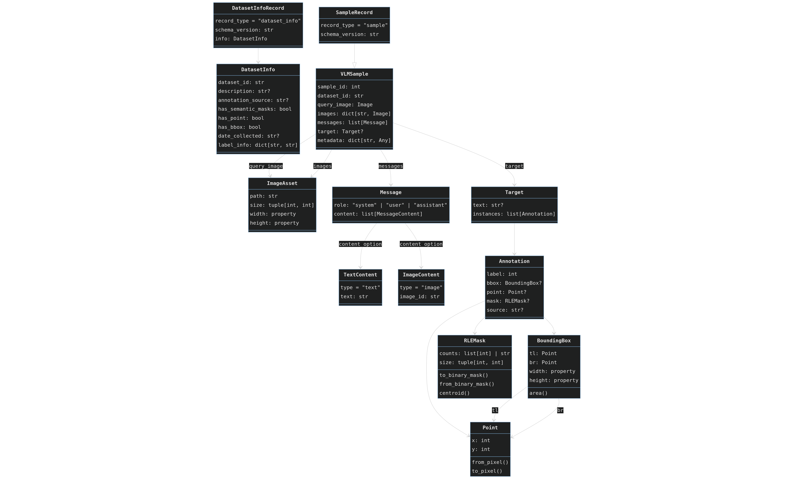
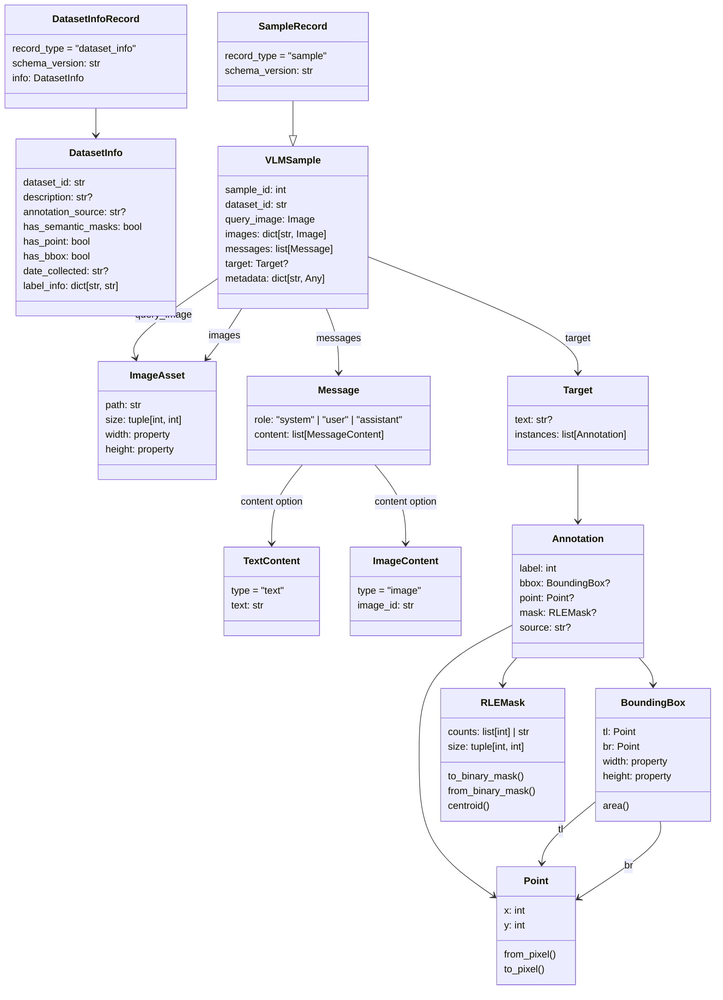

# VLM-Human Loop

This repository contains the code for the VLM-Human Loop project, which is a framework for integrating human feedback into vision-language models (VLMs) to improve their performance on various tasks. 

# Installation and Setup 

To set up the VLM-Human Loop environment, follow these steps:

1. Install pixi package manager if you haven't already. You can find the installation instructions on the [pixi repository](https://github.com/prefix-dev/pixi#installation).
2. Clone the VLM-Human Loop repository and install the dependencies using pixi:
```bash
    git clone https://github.com/bach05/vh-loop.git
    cd vh-loop
    pixi install
```

# Library Design

The folder structure of the VLM-Human Loop project is organized as follows:
- `scripts/`: main container for Python source code, including modules for data processing, model training, and evaluation.
  - `core/`: contains core common utilities and functions used across the project.
  - `data/`: contains code for data representation, loading, and preprocessing.
  - `models/`: contains code for wrapping and integrating the vision-language model.
  - `training/`: contains code for training the VLMs.
- `tests/`: contains code for testing the different components of the project.

## Data Representation

We define a **canonical multimodal sample** that reflects the structure of a JSONL file. From the canonical format you can export the datasets in different formats (HF Datasets, COCO format, LabelStudio Format, etc… )

The data schema contains the base informative elements of the dataset. We use `VLMSample` as a container for a data sample. A dataset is a list of `VLMSample`. It should include:
- `dataset_id`:  identifier of the dataset, e.g. `panizzolo_2026-03-30`
- `sample_id`: identifier of the sample in the dataset, integer
- `query_image`: image where to detect targets
- `images`: list of additional images to be used to build the prompt, optional
- ~~`videos`: list of videos to be used to build the prompt, optional~~
- `messages`: the chat to prompt the VLM: what to detect, description of the target objects, example images (optional), etc… and instruction to generate the bbox (classes, format).
- `target`: the prediction target, to be updated step by step.
    - `text`:  a short answer (like just the bboxes) or a reasoning for the CoT.
    - `instances`: bbox, mask, points (initialized with the mask centroid)
    - `semantic_mask`: a semantic mask of the target objects
- `metadata`: additional metadata about the sample, e.g. the source of the data, the date of collection, etc…

### Schema Visualization 



<details>
  <summary>Click to visualize mermaid source code</summary>


</details>

A dataset is stored in a JSONL file, where each line is a JSON object record:

```json
{"record_type":"dataset_info","schema_version":"vlmdojo.dataset.v1","info":{...}}
{"record_type":"sample","sample_id":1,"dataset_id":"...","images":{...},"messages":[...],"target":{...},"metadata":{...}}
```

# Train, Test, and Compare (Hydra entrypoints)

This project uses Hydra entry scripts under `tests/`:

- `tests/train_sample.py` -> trains and saves checkpoints
- `tests/test_sample.py` -> runs inference and writes `predictions.jsonl`
- `tests/compare_sample.py` -> evaluates predictions vs GT and creates CSV/plots/visualizations

## 1) Environment variables and paths

Several configs use environment-variable-based paths.

- `DATA_PATH` default: `/data`
- `MODEL_PATH` default: `/models`

Set them before running from repository root:

```bash
export DATA_PATH=/absolute/path/to/your/data
export MODEL_PATH=/absolute/path/to/your/model_outputs
```

## 2) How config composition works

The entrypoint files compose config groups from `configs/`.

- Training entrypoint: `configs/train_entrypoint.yaml`
- Testing entrypoint: `configs/test_entrypoint.yaml`
- Comparison entrypoint: `configs/compare_entrypoint.yaml`

For train/test, the active defaults are selected in the `defaults:` list, for example:

- `model`: `configs/model/{gemma4,qwen3_5}.yaml`
- `dataset`: `configs/dataset/panizzolo.yaml`
- `transform`: `configs/transform/paniz_s1000.yaml`
- `peft`: `configs/peft/lora.yaml`
- `trainer`: `configs/trainer/{gemma4_sft_trainer,qwen_sft_trainer}.yaml`
- `quantization`: `configs/quantization/{4bit,8bit}` or `null`

Use Hydra overrides directly from CLI to change groups/fields at runtime.

## 3) Train

Basic run (uses `configs/train_entrypoint.yaml` defaults):

```bash
pixi run python tests/train_sample.py
```

Common overrides:

```bash
pixi run python tests/train_sample.py model=qwen3_5 trainer=qwen_sft_trainer
pixi run python tests/train_sample.py quantization=4bit
pixi run python tests/train_sample.py debug=false
pixi run python tests/train_sample.py trainer.num_train_epochs=5 trainer.learning_rate=1e-4
```

Training output directory is controlled by `hydra.run.dir` in `configs/train_entrypoint.yaml`:

`$MODEL_PATH/vhloop/training/${exp_name}`

Checkpoints are saved there as `checkpoint-*` directories.

## 4) Test (inference)

Basic run:

```bash
pixi run python tests/test_sample.py
```

Important behavior:

- `test_sample.py` reconstructs the checkpoint path automatically from the testing run dir by replacing `/testing/` with `/training/` and selecting the latest `checkpoint-*`.
- Predictions are written to `predictions.jsonl` in the test output directory.
- If `use_adapter=false`, output dir gets `_ORI_MODEL` suffix and inference runs base model only.

Common overrides:

```bash
pixi run python tests/test_sample.py use_adapter=true
pixi run python tests/test_sample.py use_adapter=false
pixi run python tests/test_sample.py model=qwen3_5 trainer=qwen_sft_trainer
pixi run python tests/test_sample.py debug=true +debug_max_samples=32
```

Testing output directory is controlled by `hydra.run.dir` in `configs/test_entrypoint.yaml`:

`$MODEL_PATH/vhloop/testing/${exp_name}`

## 5) Compare predictions against GT

Default run (uses explicit files from `configs/compare_entrypoint.yaml`):

```bash
pixi run python tests/compare_sample.py
```

Key config fields in `configs/compare_entrypoint.yaml`:

- `gt_jsonl`: ground-truth canonical JSONL
- `predictions`: explicit list of prediction files (`name` + `path`)
- `thresholds`: IoU thresholds used for precision/recall/F1
- `class_aware`: if `true`, only same-class boxes can match
- `visualization.enabled`: create per-sample visualization grids

Useful override examples:

```bash
pixi run python tests/compare_sample.py class_aware=false thresholds=[0.5,0.75,0.9]
pixi run python tests/compare_sample.py visualization.enabled=false
pixi run python tests/compare_sample.py visualization.sample_ids=[1,2,3] visualization.max_samples=3
pixi run python tests/compare_sample.py \
  predictions=[{"name":"run_a","path":"/abs/path/run_a/predictions.jsonl"},{"name":"run_b","path":"/abs/path/run_b/predictions.jsonl"}]
```

Comparison outputs (default):

- `metrics_by_threshold.csv`
- `summary.csv`
- `precision_by_threshold.png`, `recall_by_threshold.png`, `f1_by_threshold.png`, `mean_iou_tp_by_threshold.png`
- `miou_gt_penalized.png`
- `visualizations/sample_*.png` (if visualization enabled)

## 6) Minimal end-to-end workflow

```bash
# 1) Train
pixi run python tests/train_sample.py debug=false

# 2) Test with adapter
pixi run python tests/test_sample.py use_adapter=true

# 3) Test base model (optional baseline)
pixi run python tests/test_sample.py use_adapter=false

# 4) Compare
pixi run python tests/compare_sample.py
```

If your data manifests or output locations differ from defaults, update the relevant files in `configs/` or apply Hydra CLI overrides as shown above.
