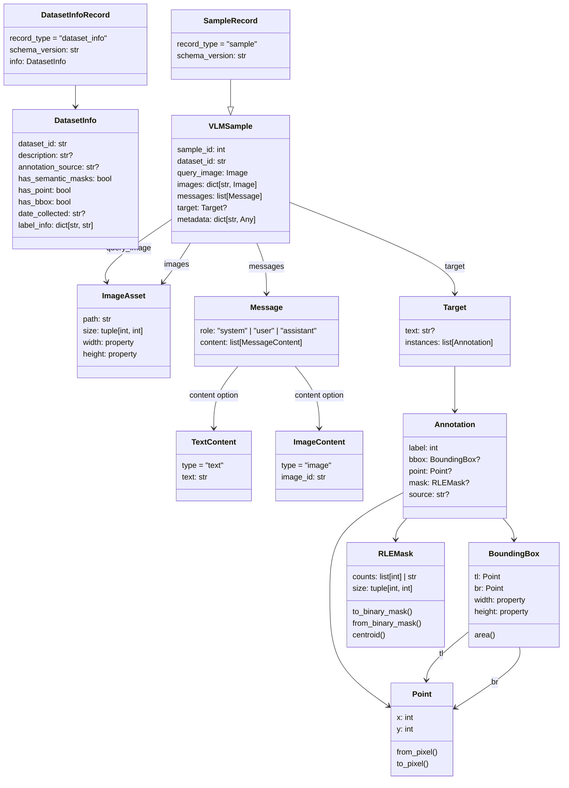

# VLM-Human Loop

This repository contains the code for the VLM-Human Loop project, which is a framework for integrating human feedback into vision-language models (VLMs) to improve their performance on various tasks. 

# Installation and Setup 

To set up the VLM-Human Loop environment, follow these steps:

1. Install pixi package manager if you haven't already. You can find the installation instructions on the [pixi repository](https://github.com/prefix-dev/pixi#installation).
2. Clone the VLM-Human Loop repository and install the dependencies using pixi:
```bash
    git clone https://github.com/bach05/vh-loop.git
    cd vh-loop
    pixi install
```

# Library Design

The folder structure of the VLM-Human Loop project is organized as follows:
- `scripts/`: main container for Python source code, including modules for data processing, model training, and evaluation.
  - `core/`: contains core common utilities and functions used across the project.
  - `data/`: contains code for data representation, loading, and preprocessing.
  - `models/`: contains code for wrapping and integrating the vision-language model.
  - `training/`: contains code for training the VLMs.
- `tests/`: contains code for testing the different components of the project.

## Data Representation

We define a **canonical multimodal sample** that reflects the structure of a JSONL file. From the canonical format you can export the datasets in different formats (HF Datasets, COCO format, LabelStudio Format, etc… )

The data schema contains the base informative elements of the dataset. We use `VLMSample` as a container for a data sample. A dataset is a list of `VLMSample`. It should include:
- `dataset_id`:  identifier of the dataset, e.g. `panizzolo_2026-03-30`
- `sample_id`: identifier of the sample in the dataset, integer
- `query_image`: image where to detect targets
- `images`: list of additional images to be used to build the prompt, optional
- ~~`videos`: list of videos to be used to build the prompt, optional~~
- `messages`: the chat to prompt the VLM: what to detect, description of the target objects, example images (optional), etc… and instruction to generate the bbox (classes, format).
- `target`: the prediction target, to be updated step by step.
    - `text`:  a short answer (like just the bboxes) or a reasoning for the CoT.
    - `instances`: bbox, mask, points (initialized with the mask centroid)
    - `semantic_mask`: a semantic mask of the target objects
- `metadata`: additional metadata about the sample, e.g. the source of the data, the date of collection, etc…

### Schema Visualization 


<details>
  <summary>Click to visualize mermaid source code</summary>


</details>

A dataset is stored in a JSONL file, where each line is a JSON object representing a `VLMSample`: 

**TO BE FIXED**: draft definition.

```json 
{
"info": {
    "dataset_id": "panizzolo_v1",
    "description": "Dataset of images of electric motors with annotations for stators, rotors, armatures and drive shafts.",
    "annotation_source": "human",
    "has_semantic_masks": false,
    "has_point": false,
    "has_bbox": true,
    "date_collected": "2026-03-30",
    "label_info": {
        "0": "background",
        "1": "stator",
        "2": "rotor",
        "3": "armature",
        "4": "drive shaft"
    }
},
"data": [
    {
    "sample_id": 1,
    "dataset_id": "panizzolo_v1",
    "split": "train",
    "query_image": 
    {
      "id": "query",
      "local_path": "/data/images/motor_000001.png",
      "width": 2448,
      "height": 2048
    },
    "images": [
    {
      "id": "sample1",
      "local_path": "/data/images/motor_000001.png",
      "width": 2448,
      "height": 2048
    }
    ],
    "messages": [
    {
      "role": "user",
      "content": [
        {
          "type": "image",
          "image_id": "query"
        },
        {
          "type": "text",
          "text": "Detect all stators, rotors, armatures and drive shafts."
        }
      ]
    }
    ],
    "target": {
    "text": "[{\"class\":\"stator\",\"box\":[442,456,505,570]}]",
    "instances": [
      {
        "label": "stator",
        "bbox_xyxy": [
          442,
          456,
          505,
          570
        ],
        "mask": null,
        "points": null
        "source": "human"
      }
    ],
    "semantic_mask": null
    }
    }
  ]
}
```

